# Wireless Sensor Network Lifetime Optimization 📡🔋

A comprehensive MATLAB simulation framework for analyzing and optimizing the lifetime of clustered Wireless Sensor Networks (WSN) through cluster head rotation strategies and dedicated special nodes deployment.


## 📋 Description

This project implements a complete simulation environment for Wireless Sensor Networks with energy-constrained sensor nodes. It compares two clustering strategies: rotating cluster heads selected from regular nodes versus dedicated special nodes with higher energy capacity. The simulation determines optimal parameters to maximize network lifetime while maintaining efficient data aggregation and transmission to a central sink.

The implementation includes realistic energy consumption models, dual-hop transmission with free-space and multipath propagation, dynamic cluster formation algorithms, comprehensive lifetime analysis metrics, and parameter optimization for both clustering strategies.

<br>
<div align="center">
  <a href="https://codeload.github.com/yourusername/wsn-lifetime-optimization/legacy.zip/main">
    
  </a>
</div>

## 🎯 Project Objectives

1. **Network Generation**: Create realistic WSN with random node deployment
2. **Energy Modeling**: Implement transceiver and channel propagation models
3. **Clustering Algorithms**: Develop cluster head election and assignment strategies
4. **Lifetime Analysis**: Measure network lifetime until first node death (T1)
5. **Parameter Optimization**: Find optimal rotation period (C) and placement radius (R)
6. **Comparative Analysis**: Evaluate rotating CHs vs. dedicated special nodes

## ✨ Features

### Network Architecture
- **100 Sensor Nodes**: Randomly distributed in 100m × 100m area
- **Central Sink**: Located at network center (50m, 50m)
- **Homogeneous Nodes**: All regular sensors start with 2J energy
- **Special Nodes**: Optional 5 dedicated CHs with 4J energy each
- **Dual-Hop Communication**: Nodes → Cluster Heads → Sink

### Energy Consumption Model

#### Transmission Energy
```
Short Distance (d ≤ d0):
E_tx = k × E_elec + k × ε_amp_short × d²

Long Distance (d > d0):
E_tx = k × E_elec + k × ε_amp_long × d⁴

where d0 = √(ε_amp_short / ε_amp_long) ≈ 87.71 m
```

#### Reception and Aggregation
```
E_rx = k × E_elec
E_agg = k × E_agg × num_signals
```

### Clustering Strategies

#### Strategy 1: Rotating Cluster Heads
- 5% of alive nodes elected as CHs every C cycles
- Energy-based CH election (nodes must have sufficient energy)
- Dynamic cluster reformation every C cycles
- All nodes share CH burden over time

#### Strategy 2: Dedicated Special Nodes
- 5 special nodes with 2× energy (4J vs 2J)
- Uniformly distributed on circle of radius R around sink
- Fixed cluster assignment (no rotation)
- Special nodes only aggregate and forward data

### Advanced Features
- **Intelligent CH Election**: Ensures CHs have sufficient energy for C cycles
- **Dynamic Cluster Assignment**: Nodes join nearest alive CH
- **Energy-Aware Routing**: Uses shortest path to minimize consumption
- **Realistic Propagation**: Free-space and multipath fading models
- **Comprehensive Logging**: Tracks node deaths and energy levels
- **Safety Mechanisms**: Prevents infinite loops and handles edge cases

## 🔬 Methodology

### Network Parameters

| Parameter | Symbol | Value |
|-----------|--------|-------|
| Network Size | M × M | 100m × 100m |
| Number of Sensors | N | 100 nodes |
| Initial Energy (Regular) | E_init | 2 Joules |
| Initial Energy (Special) | E_special | 4 Joules |
| TX/RX Electronics | E_elec | 50 nJ/bit |
| TX Amplifier (Short) | ε_amp_short | 10 pJ/bit/m² |
| TX Amplifier (Long) | ε_amp_long | 0.0013 pJ/bit/m⁴ |
| Aggregation Energy | E_agg | 50 nJ/bit/signal |
| Data Packet Size | - | 500 bytes (4000 bits) |
| Overhead Packet Size | - | 125 bytes (1000 bits) |
| Distance Threshold | d0 | 87.71 m |

### Simulation Workflow

**Part A: Network Generation**
```matlab
% Random node deployment
nodes_x = 100 * rand(100, 1);
nodes_y = 100 * rand(100, 1);
sink_x = 50; sink_y = 50;
```

**Part B: Rotating CHs (C=5)**
```matlab
% Every 5 cycles:
1. Elect 5 CHs (5% of 100 nodes)
2. Form clusters (assign nodes to nearest CH)
3. Regular nodes → transmit to CH
4. CHs → aggregate + transmit to sink
5. Update energy, check for deaths
```

**Part C: Lifetime Analysis**
```matlab
T1 = first_node_death_cycle
energy_at_T1 = remaining_energy_vector
```

**Part D: Optimize C**
```matlab
% Test C from 1 to 20 cycles
for C = 1:20
    T1(C) = simulate_wsn_rotation(...)
end
C_optimal = argmax(T1)
```

**Part E: Special Nodes (R=25m)**
```matlab
% 5 special CHs on circle
angles = [0, 72, 144, 216, 288] degrees
ch_x = 50 + 25 * cos(angles)
ch_y = 50 + 25 * sin(angles)
```

**Part F: Optimize R**
```matlab
% Test R from 5m to 50m
for R = 5:5:50
    T1(R) = simulate_wsn_special_nodes(...)
end
R_optimal = argmax(T1)
```

**Part G: Comprehensive Comparison**
- Compare T1 for all strategies
- Analyze energy efficiency (cycles/Joule)
- Evaluate trade-offs

### Energy Consumption Breakdown

**Regular Node (per cycle):**
```
E_tx_to_CH = overhead_packet × (E_elec + ε_amp × d²/d⁴)
Total ≈ 1000 bits × (50 + 10×d²) nJ
```

**Cluster Head (per cycle):**
```
E_rx_total = overhead_packet × E_elec × num_members
E_agg = data_packet × E_agg × num_signals
E_tx_to_sink = data_packet × (E_elec + ε_amp × d²/d⁴)

Total ≈ 1000×50×20 + 4000×50×20 + 4000×(50 + ε×d²/d⁴) nJ
     = ~5,200,000 nJ = ~5.2 mJ per cycle
```

### Cluster Head Election Algorithm

```matlab
function ch_indices = elect_cluster_heads(...)
    % 1. Find alive nodes
    alive_indices = find(is_alive);
    
    % 2. Calculate required energy for C cycles
    E_required = C × (E_rx + E_agg + E_tx_to_sink);
    
    % 3. Select nodes with sufficient energy
    valid_candidates = nodes where energy > E_required;
    
    % 4. Choose top 5% by remaining energy
    [sorted_energy, idx] = sort(energy, 'descend');
    ch_indices = valid_candidates(1:num_ch);
end
```

## 📊 Results

### Part B: Rotating CHs (C=5)

**Network Topology:**

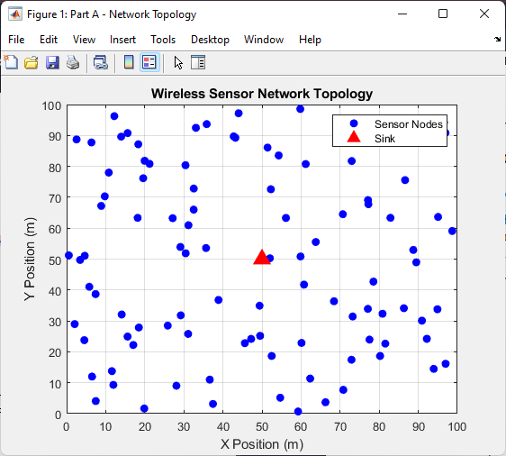

**Active Nodes vs Cycles:**

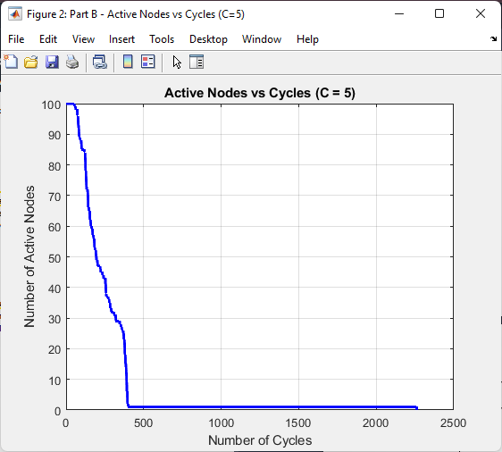

**Key Results:**
- **T1 (First Node Death)**: 54 cycles
- **Last Node Death**: 2262 cycles (one outlier node)
- **Network Degradation**: Rapid decline after T1, then extended tail

### Part C: Energy Analysis at T1

**Remaining Energy Distribution at T1:**

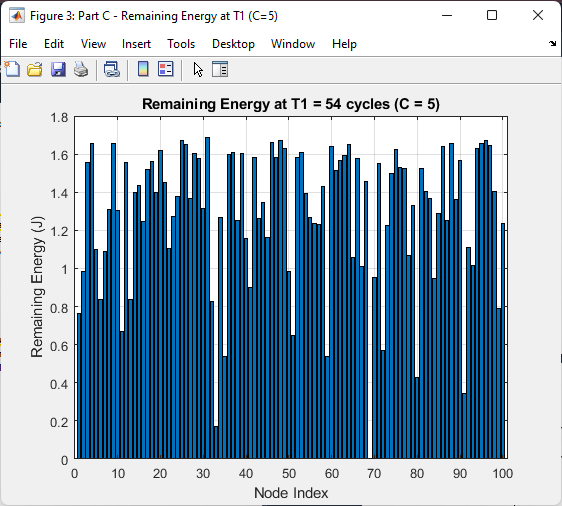

**Energy Statistics:**
- **Mean Remaining**: 1.29 J (64.5% of initial)
- **Std Deviation**: 0.37 J
- **Max Remaining**: 1.69 J (84.5%)
- **Min Remaining**: 0.00 J (depleted)

**Observations:**
- Energy consumption is non-uniform
- High standard deviation indicates unbalanced load
- Wide range suggests suboptimal CH rotation frequency

### Part D: Optimal C Selection

**Network Lifetime vs Rotation Period:**

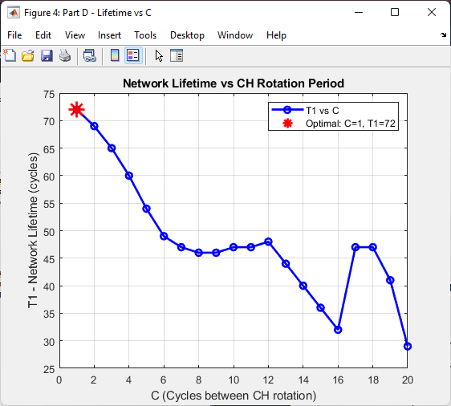

**Remaining Energy at Optimal C:**


**Optimization Results:**
- **Optimal C**: 1 cycle
- **Maximum T1**: 72 cycles
- **Improvement over C=5**: +33.3%

**Analysis:**
- **C=1 (Optimal)**: Frequent rotation balances load evenly
- **C=5 (Baseline)**: Moderate performance (T1 = 54)
- **C=20 (Poor)**: T1 drops to 29 cycles (-59.7% vs optimal)
- **Why C=1 is best**: Load distributed evenly, prevents "victim" nodes

### Part E: Special Nodes (R=25m)

**Network Topology with Special Cluster Heads:**

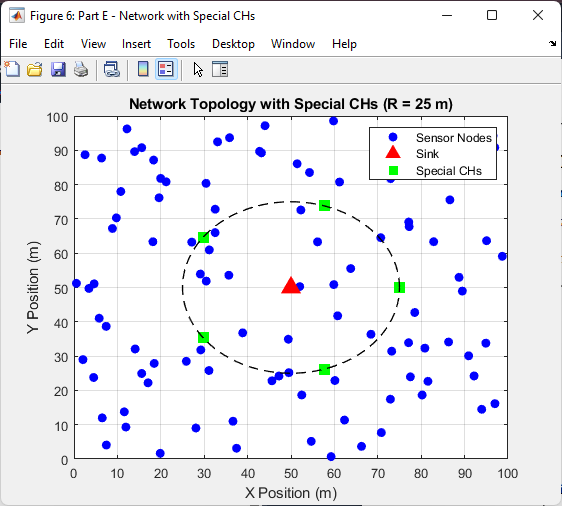

**Detailed Comparison (Early Cycles):**

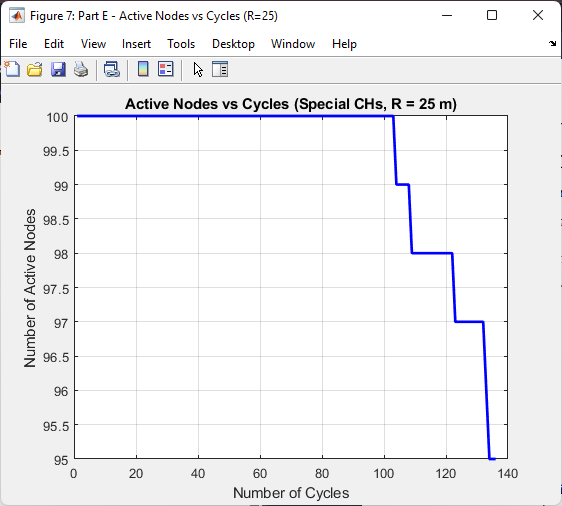

**Remaining Energy Distribution (R=25m):**

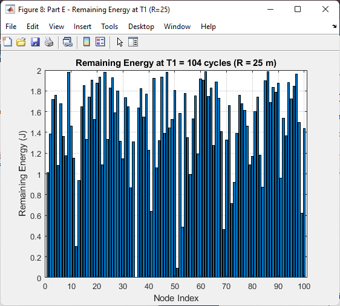

**Complete Lifetime Comparison:**

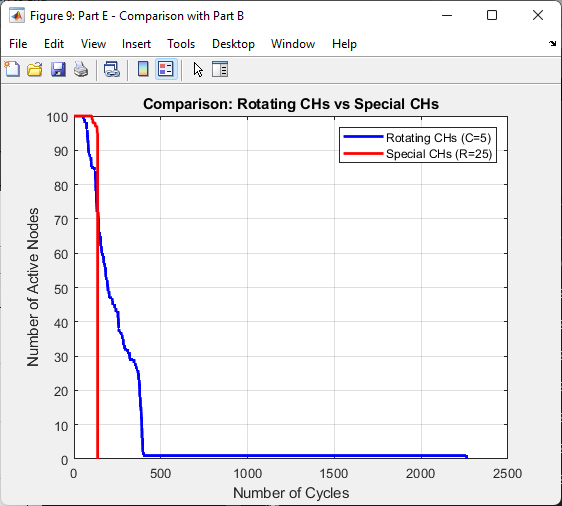

**Special Nodes Results:**
- **T1**: 104 cycles
- **Last Node Death**: 136 cycles (predictable)
- **Improvement over C=5**: +92.6%
- **Improvement over C=1**: +44.4%

**Key Observations:**
- Special CHs maintain 100% reliability until cycle 104
- Stepwise decline at cycle 104 (5 special CHs deplete)
- Regular nodes deplete uniformly
- No long-surviving outliers (predictable death)

### Part F: Optimal R Selection

**Network Lifetime vs CH Placement Radius:**

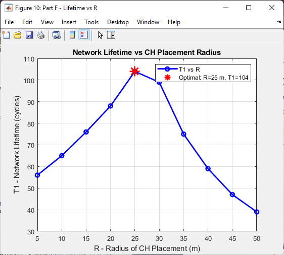

**Remaining Energy at Optimal Radius:**


**Optimization Results:**
- **Optimal R**: 25 meters
- **Maximum T1**: 104 cycles
- **At R=5m**: T1 = 56 cycles (-46% vs optimal)
- **At R=50m**: T1 = 39 cycles (-62% vs optimal)

**Analysis:**
- **Small R** (5-15m): CHs too close to sink, poor coverage, high node→CH energy
- **Optimal R** (25m): Balance between coverage and CH→sink distance
- **Large R** (40-50m): CHs too far from sink, high transmission energy (d⁴ model)

### Part G: Comprehensive Comparison

**T1 Comparison Across All Strategies:**

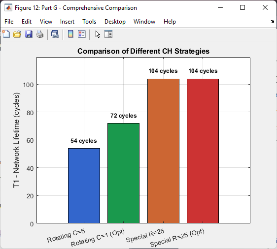

**Energy Efficiency Analysis:**

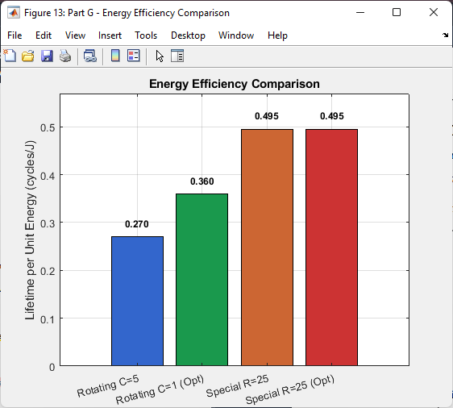

### Summary Table

| Strategy | C / R | T1 (cycles) | Total Energy (J) | Efficiency (cycles/J) |
|----------|-------|-------------|------------------|----------------------|
| **Rotating CHs** | C=5 | 54 | 200 | 0.270 |
| **Rotating CHs (Optimal)** | C=1 | 72 | 200 | 0.360 |
| **Special Nodes** | R=25m | 104 | 210 | 0.495 |
| **Special Nodes (Optimal)** | R=25m | 104 | 210 | 0.495 |

### Key Findings

**1. Optimal Parameters:**
- Rotating CHs: C = 1 cycle maximizes T1 at 72 cycles
- Special Nodes: R = 25m maximizes T1 at 104 cycles

**2. Performance Comparison:**
- Special nodes achieve **92.6% improvement** over baseline rotating (C=5)
- Special nodes achieve **44.4% improvement** over optimal rotating (C=1)
- Energy efficiency: 0.495 vs 0.360 cycles/Joule (+37.5%)

**3. Energy Distribution:**
- Rotating: Non-uniform depletion, one outlier survives 2262 cycles
- Special: Uniform depletion, predictable death at 136 cycles

**4. Best Strategy:**
- **Winner**: Special Nodes with R=25m
- **Reason**: 44% higher lifetime, better efficiency, balanced load, predictable behavior
- **Cost**: +5% energy investment (210J vs 200J)

## 🚀 Getting Started

### Prerequisites

**Software:**
```
MATLAB R2018b or later
Statistics and Machine Learning Toolbox (optional)
```

### Installation

1. **Download Files**
```bash
# Clone repository or download ZIP
git clone https://github.com/yourusername/wsn-lifetime-optimization.git
cd wsn-lifetime-optimization
```

2. **File Structure**
```
wsn-lifetime-optimization/
├── WSN_Main_Simulation_FINAL.m          # Main simulation script
├── simulate_wsn_rotation.m              # Rotating CHs simulation
├── simulate_wsn_special_nodes.m         # Special nodes simulation
├── images/                              # Result figures (PNG)
├── Figures/                             # MATLAB figures (.fig)
└── README.md
```

### Usage

**Run Complete Simulation:**
```matlab
% Open MATLAB and navigate to project directory
cd path/to/wsn-lifetime-optimization

% Run main script
WSN_Main_Simulation_FINAL

% Expected runtime: 5-10 minutes
% Generates 13 figures automatically
```

**Run Individual Parts:**
```matlab
% Part B only: Simulate with C=5
[cycles, active_nodes, T1, energy_T1] = simulate_wsn_rotation(...
    nodes_x, nodes_y, sink_x, sink_y, N, E_init, 5, ...
    E_elec, eps_amp_short, eps_amp_long, E_agg, ...
    data_packet_size, overhead_packet_size, d0);

% Part E only: Simulate with special nodes R=25
[cycles, active_nodes, T1, energy_T1, ch_x, ch_y] = ...
    simulate_wsn_special_nodes(nodes_x, nodes_y, sink_x, sink_y, ...
    N, E_init, 25, E_elec, eps_amp_short, eps_amp_long, ...
    E_agg, data_packet_size, overhead_packet_size, d0);
```

**Customize Parameters:**
```matlab
% Edit network parameters in WSN_Main_Simulation_FINAL.m
M = 100;              % Network size (try 150 or 200)
N = 100;              % Number of nodes (try 150)
E_init = 2;           % Initial energy (try 3 or 4)
C_range = 1:20;       % Test range for C optimization
R_range = 5:5:50;     % Test range for R optimization
```

## 🎓 Learning Outcomes

This project demonstrates:

1. **WSN Fundamentals**: Energy constraints, clustering, data aggregation
2. **Energy Modeling**: Realistic transceiver and channel models
3. **Optimization Techniques**: Parameter sweeping, lifetime maximization
4. **Algorithm Design**: CH election, cluster formation, routing
5. **MATLAB Programming**: Simulation, vectorization, visualization
6. **Trade-off Analysis**: Performance vs. cost, distributed vs. dedicated

## 🔄 Design Trade-offs

### Rotating CHs vs. Special Nodes

**Rotating Cluster Heads:**
- ✅ No additional hardware cost
- ✅ Distributed load sharing
- ✅ Simpler deployment (homogeneous nodes)
- ❌ Lower absolute lifetime (T1 = 72 cycles)
- ❌ Non-uniform energy depletion
- ❌ Unpredictable network death (outlier nodes)
- ❌ CH election overhead

**Dedicated Special Nodes:**
- ✅ 44% longer lifetime (T1 = 104 cycles)
- ✅ Uniform energy depletion
- ✅ Predictable network behavior
- ✅ Better energy efficiency (0.495 vs 0.360 cycles/J)
- ✅ No rotation overhead
- ❌ 5% more energy investment (210J vs 200J)
- ❌ Requires planned deployment
- ❌ Higher deployment cost

### Parameter Selection Insights

**Cluster Head Rotation Period (C):**
- **C=1 (Optimal)**: Best load balancing, maximum T1 = 72 cycles
- **C=5 (Baseline)**: Moderate performance, T1 = 54 cycles
- **C=20 (Poor)**: High imbalance, T1 = 29 cycles

**CH Placement Radius (R):**
- **Small R** (5-20m): Poor coverage, unbalanced clusters
- **Optimal R** (25m): Even load distribution, T1 = 104 cycles
- **Large R** (40-50m): High CH→sink transmission energy

## 💡 Practical Recommendations

### Choose Rotating CHs (C=1) When:
- Budget constraints prohibit specialized hardware
- Simpler deployment is prioritized
- Network topology may change post-deployment
- Application tolerates unpredictable node failures

### Choose Special CHs (R=25m) When:
- Maximum network lifetime is critical
- Additional 5% cost is acceptable
- Predictable network behavior is required
- Sink location is fixed and known
- Application requires reliable data collection

## 🤝 Contributing

Contributions are welcome! Areas for contribution include implementing additional clustering protocols (LEACH, HEED, PEGASIS), adding energy harvesting models, creating GUI for interactive simulation, or porting to Python using NetworkX.

## 📄 License

This project is licensed under the MIT License.

## 🙏 Acknowledgments

- Prof. Samy S. Soliman for the original problem formulation
- CIE 510 - Wireless Sensor Networks and IoT course
- "Hierarchically Clustered Wireless Sensor Networks: Lifetime Optimization Techniques" (LAP LAMBERT Academic Publishing, 2012)

<br>
<div align="center">
  <a href="https://codeload.github.com/yourusername/wsn-lifetime-optimization/legacy.zip/main">
    
  </a>
</div>

## <!-- CONTACT -->
<!-- END CONTACT -->

## **Maximize sensor network lifetime through intelligent clustering! 📡✨**
